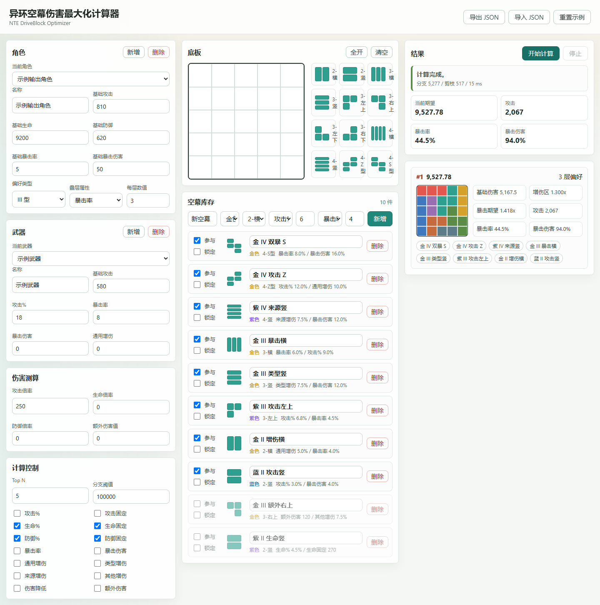
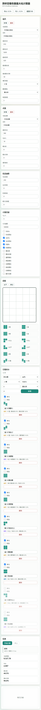

# 异环空幕伤害最大化计算器

`NTE DriveBlock Optimizer` 是一个面向《异环》（Neverness to Everness）的本地 Web 工具，用于在玩家给定角色、武器、空幕库存和 5x5 空幕底板后，搜索能够完全填满底板的空幕组合，并按期望伤害输出 Top N 最优方案。

项目当前是无构建依赖的静态前端：浏览器原生 ES Modules 负责界面和状态管理，Web Worker 负责 CPU 密集型求解，避免阻塞主线程。

## 界面预览





## 功能特性

- 5x5 底板编辑：点击或拖拽切换可用格/不可用格。
- 固定空幕形状库：沿用 II/III/IV 型 2、3、4 格形状，不旋转、不翻转。
- 库存管理：支持新增、删除、参与计算、锁定必选空幕。
- 本地持久化：自动保存到浏览器本地存储，刷新后数据不丢失。
- JSON 导入/导出：方便备份、迁移和共享角色/武器/库存配置。
- 无效词条过滤：可过滤生命、防御等对当前输出角色无效的空幕。
- Web Worker 求解：递归搜索和伤害计算在 Worker 中执行。
- 防爆破熔断：分支数量超过阈值时中止并提示减少库存或增加锁定条件。
- Top N 结果展示：展示期望伤害、偏好层数、伤害拆解、面板和摆放图。

## 核心规则

空间排列规则参考 [NoroHime/NTE-DriveBlock-Solver](https://github.com/NoroHime/NTE-DriveBlock-Solver)：

- 空幕只使用初始形态，禁止旋转和翻转。
- 求解器只接受 100% 填满底板的方案。
- 锁定空幕表示“必须参与本次方案”，位置由求解器搜索。
- 底板为 5x5 网格，不可用格不会参与填充。
- 搜索时优先处理锁定空幕，再按潜在伤害收益排序候选库存。

当前内置形状包括：

- II 型：`2-横`、`2-竖`
- III 型：`3-横`、`3-竖`、`3-左上`、`3-右上`、`3-左下`、`3-右下`
- IV 型：`4-横`、`4-竖`、`4-Z型`、`4-S型`

## 伤害模型

当前版本实现 PRD 中的基础伤害区、增伤区和暴击期望：

```text
期望伤害 = 基础伤害区 * 增伤区 * 暴击期望

基础伤害区 = Σ(伤害倍率 * 对应属性) + 额外伤害值

攻击 = (角色基础攻击 + 武器基础攻击) * (1 + 攻击百分比加成) + 攻击固定值加成
生命 = 角色基础生命 * (1 + 生命百分比加成) + 生命固定值加成
防御 = 角色基础防御 * (1 + 防御百分比加成) + 防御固定值加成

增伤区 = 1 + 通用增伤 + 类型增伤 + 来源增伤 + 其他增伤 - 造成伤害降低

暴击期望 = 1 + 暴击率 * 暴击伤害
```

角色偏好机制会在每个方案计算时动态统计偏好空幕数量，并按“每件偏好空幕一层”的规则叠加到指定属性上。

说明：当前内置词条数值表是便于试算和演示的可配置数据，正式使用时建议按游戏实测数据更新 `src/data/defaults.js` 中的 `STAT_VALUE_RULES`。

## 运行方式

当前实现不依赖 npm 包，不需要执行 `npm install`。需要本机有 Node.js。

```bash
node server.mjs --port 4173
```

然后打开：

```text
http://127.0.0.1:4173/
```

在 Codex 桌面环境中可使用内置 Node：

```powershell
C:\Users\a\.cache\codex-runtimes\codex-primary-runtime\dependencies\node\bin\node.exe server.mjs --port 4173
```

也可以使用 package script：

```bash
npm run dev
```

## 使用流程

1. 在左侧配置角色、武器和伤害倍率。
2. 在“计算控制”中选择 Top N、分支阈值和无效词条。
3. 在中间编辑 5x5 底板，可用格会被求解器填充。
4. 在库存区勾选参与计算的空幕，必要时勾选“锁定”。
5. 点击“开始计算”，等待 Worker 返回结果。
6. 在结果区查看 Top N 方案、摆放图、期望伤害和伤害拆解。
7. 使用“导出 JSON”备份数据，使用“导入 JSON”恢复数据。

## 项目结构

```text
.
├── index.html
├── server.mjs
├── src
│   ├── app.js                  # 前端 UI、事件绑定和 Worker 通信
│   ├── storage.js              # 本地持久化和 JSON 导入导出
│   ├── styles.css              # 页面样式
│   ├── damage/calc.js          # 伤害计算
│   ├── data/defaults.js        # 形状、默认数据和词条规则
│   ├── data/schema.ts          # TypeScript 数据结构规范
│   ├── solver/placement.js     # 空间搜索、剪枝和排序
│   └── worker/optimizer.worker.js
└── docs/images                 # README 预览图
```

## 开发说明

- 核心求解器只处理可用格集合，不依赖 DOM。
- Worker 输入包括底板、库存、角色、武器、技能参数、无效词条和分支阈值。
- Worker 输出包括状态、Top N 结果、分支数、剪枝数和耗时。
- 如需扩展敌方防御区、抗性区、易伤区等乘区，建议在 `src/damage/calc.js` 中扩展返回的伤害拆解结构。
- 如需改为空幕预设底板，可在 `src/data/defaults.js` 增加角色底板数据，再在 UI 中提供选择入口。

## 参考与致谢

- 空幕形状库和基础 DFS 思路参考 [NoroHime/NTE-DriveBlock-Solver](https://github.com/NoroHime/NTE-DriveBlock-Solver)。
- 本项目在其空间规则基础上增加了库存、角色偏好、伤害排序、Web Worker 和本地数据管理。

## License

MIT License. See [LICENSE](LICENSE) for details.
